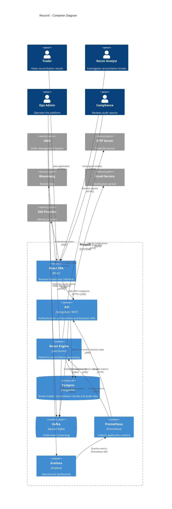

# ReconX – C4 Level 2 Container Diagram

```mermaid
C4Container
title ReconX - Container Diagram

Person(trader, "Trader", "Views reconciliation results")
Person(analyst, "Recon Analyst", "Investigates reconciliation breaks")
Person(ops, "Ops Admin", "Operates the platform")
Person(compliance, "Compliance", "Reviews audit reports")

System_Ext(oms, "OMS", "Order Management System")
System_Ext(sftp, "SFTP Server", "Trade file source")
System_Ext(bloomberg, "Bloomberg", "Market data")
System_Ext(email, "Email Service", "Notification service")
System_Ext(sso, "SSO Provider", "Identity provider")

System_Boundary(reconxBoundary, "ReconX") {

    Container(spa, "React SPA", "React", "Browser-based user interface")

    Container(api, "API", "Spring Boot / REST", "Authentication, orchestration and business APIs")

    Container(engine, "Recon Engine", "Java Service", "Performs reconciliation processing")

    ContainerDb(postgres, "Postgres", "PostgreSQL", "Stores trades, reconciliation results and audit data")

    ContainerQueue(kafka, "Kafka", "Apache Kafka", "Trade event streaming")

    Container(prometheus, "Prometheus", "Prometheus", "Collects application metrics")

    Container(grafana, "Grafana", "Grafana", "Operational dashboards")
}

Rel(trader, spa, "Uses application", "HTTPS")
Rel(analyst, spa, "Investigates breaks", "HTTPS")
Rel(ops, grafana, "Views dashboards", "HTTPS")
Rel(compliance, spa, "Reviews reports", "HTTPS")

Rel(spa, sso, "Authenticate users", "OIDC")
Rel(spa, api, "Calls REST endpoints", "HTTPS / JSON")

Rel(api, postgres, "Reads and writes business data", "JDBC")
Rel(api, kafka, "Publishes trade events", "Kafka")
Rel(api, email, "Sends notifications", "SMTP")

Rel(engine, kafka, "Consumes trade events", "Kafka")
Rel(engine, postgres, "Stores reconciliation results", "JDBC")
Rel(engine, bloomberg, "Retrieves market data", "HTTPS")
Rel(engine, sftp, "Imports trade files", "SFTP")

Rel(oms, kafka, "Publishes trade events", "Kafka")

Rel(prometheus, api, "Scrapes metrics", "HTTP")
Rel(prometheus, engine, "Scrapes metrics", "HTTP")
Rel(grafana, prometheus, "Queries metrics", "Prometheus API")
```
